# Phase 2 — Domain Model

This section documents every database entity, its purpose, lifecycle transitions, relationships, and granular RBAC constraints.

---

## Entity: Analytics

The `Analytics` represents structured views and reporting metrics calculated from academic and transactional database tables.

---

## 1. Purpose

It aggregates raw data into reports (e.g. class attendance rates, student grades, institution financial trends) to help administrators and teachers evaluate institution performance.

---

## 2. Relationships

Analytics are calculated from:
* **Enrollment / Attendance**: Cohort participation rates.
* **Submission / AssignmentSubmission**: Score distributions, homework completion metrics, and grade curves.
* **TuitionInvoice / ExpenseItem**: Profit-and-loss balances, invoice collection stats, and operational overhead metrics.

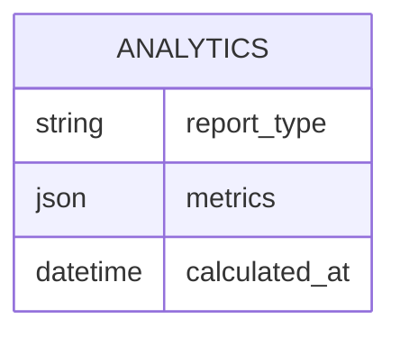
```mermaid
erDiagram
    ANALYTICS {
        string report_type
        json metrics
        datetime calculated_at
    }
```

---

## 3. Lifecycle

1. **Aggregation**: Computed dynamically in the backend (via `analytics/views.py` endpoints) using Django query filters and aggregates (`Avg`, `Sum`, `Count`).
2. **Export**: Rendered as charts on the admin dashboard, or exported as CSV/Excel reports (via `/api/analytics/reports/export/`).

---

## Entity: Assessment

The `Assessment` entity represents an exam, quiz, or test scheduled for students.

---

## 1. Purpose

It enables formal student evaluations, question-pool management, structured timing parameters, and automated or manual grading.

---

## 2. Relationships

An `Assessment` connects to:
* **Organization**: Many-to-one via `organization` (ForeignKey).
* **Session**: Many-to-one via `session` (optional ForeignKey linking it to a lecture).
* **Question**: Many-to-many via `questions` (through `AssessmentQuestion` mapping order and individual point allocations).
* **Submission**: One-to-many via `submissions` (reverse relationship).

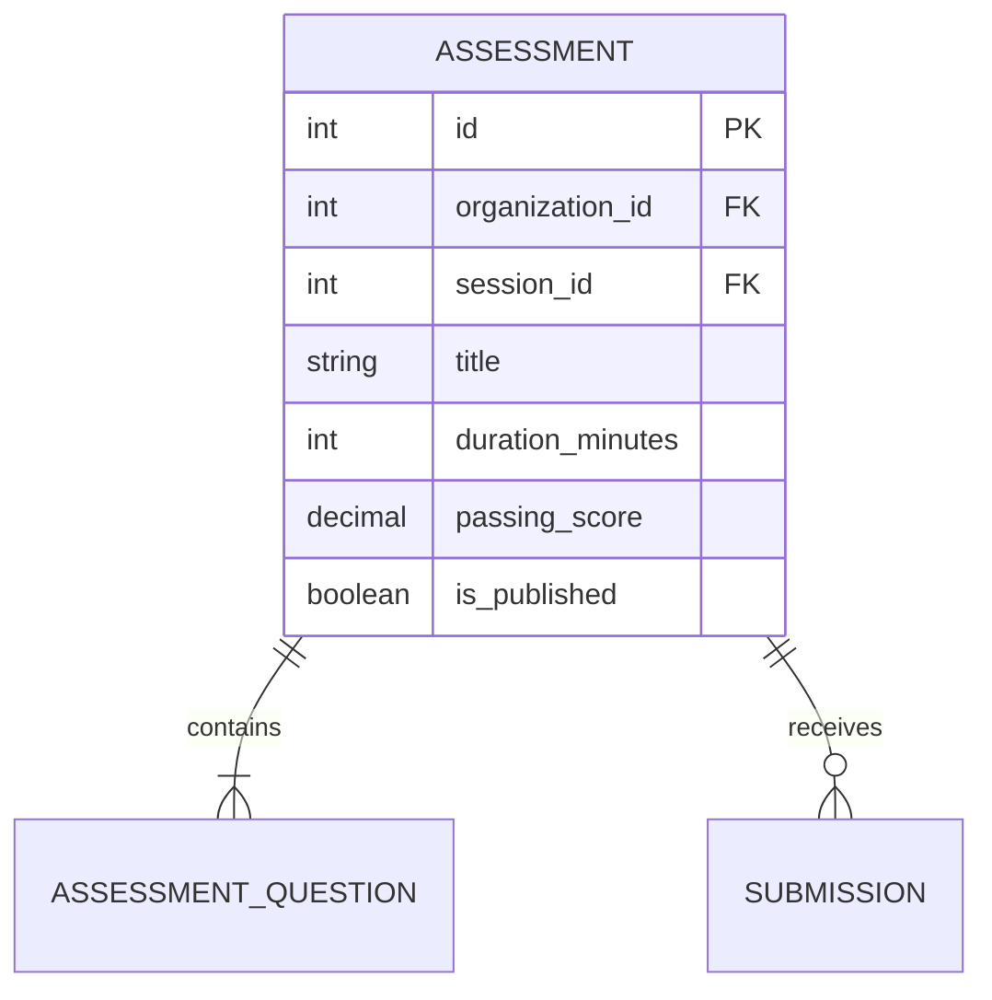
```mermaid
erDiagram
    ASSESSMENT {
        int id PK
        int organization_id FK
        int session_id FK
        string title
        int duration_minutes
        decimal passing_score
        boolean is_published
    }
    ASSESSMENT ||--|{ ASSESSMENT_QUESTION : "contains"
    ASSESSMENT ||--o{ SUBMISSION : "receives"
```

---

## 3. Lifecycle

1. **Composition**: A teacher or admin creates the assessment shell, adding questions from the `QuestionBank` via the `AssessmentQuestion` helper table.
2. **Publishing**: Toggled to `is_published = True`, making it visible to enrolled students on their portals.
3. **Attempt Phase**: Students take the test under time limits.
4. **Grading**: Submissions are graded, and final scores are posted.

---

## Entity: Assessment Attempt

The `Submission` entity (referred to as Assessment Attempt) represents a student's answer sheet and telemetry log for a specific exam.

---

## 1. Purpose

It captures individual student quiz submissions, logs anti-cheat telemetry (tab focus losses, IP tracking, browser signatures), and records question grading cards.

---

## 2. Relationships

A `Submission` connects to:
* **Assessment**: Many-to-one via `assessment` (ForeignKey).
* **User (Student)**: Many-to-one via `student` (ForeignKey).
* **User (Grader)**: Many-to-one via `graded_by` (ForeignKey).
* **StudentAnswer**: One-to-many via `answers` (reverse relationship mapping student answers to individual questions).

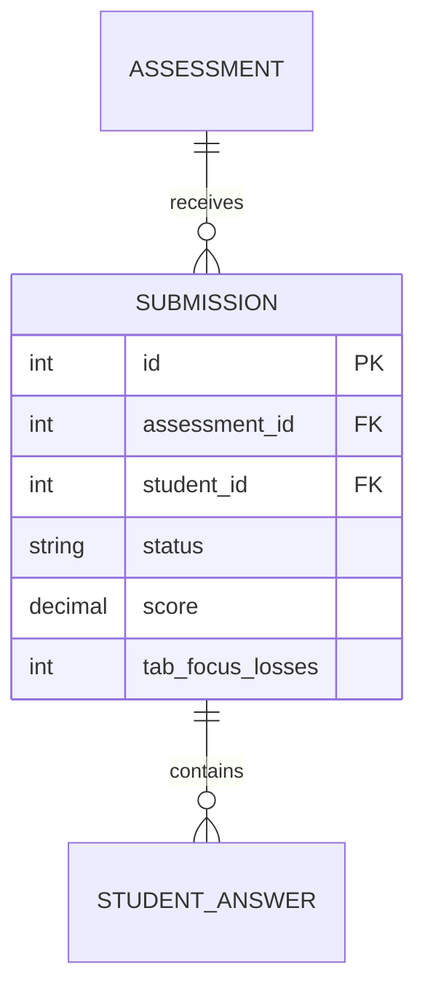
```mermaid
erDiagram
    SUBMISSION {
        int id PK
        int assessment_id FK
        int student_id FK
        string status
        decimal score
        int tab_focus_losses
    }
    ASSESSMENT ||--o{ SUBMISSION : "receives"
    SUBMISSION ||--o{ STUDENT_ANSWER : "contains"
```

---

## 3. Lifecycle

1. **Initiation**: When a student clicks "Start Quiz", a `Submission` row is created with status `started`, starting a countdown timer based on `duration_minutes`.
2. **Submission**: When the student finishes or the timer expires, the status moves to `submitted`, locking further answers. Anti-cheat metrics are summarized.
3. **Grading**: Standard questions are auto-graded. Short-answer/text answers are manually scored by the teacher, status changes to `graded`, and the final score is set.

---

## Entity: Assignment

The `Assignment` entity represents a homework task or project assigned to a class.

---

## 1. Purpose

It enables homework distribution, instruction sharing, due-date enforcement, and student submission tracking.

---

## 2. Relationships

An `Assignment` connects to:
* **Organization**: Many-to-one via `organization` (ForeignKey).
* **AcademyClass**: Many-to-one via `academy_class` (ForeignKey).
* **User (Creator)**: Many-to-one via `created_by` (ForeignKey).
* **AssignmentSubmission**: One-to-many via `submissions` (reverse relationship).

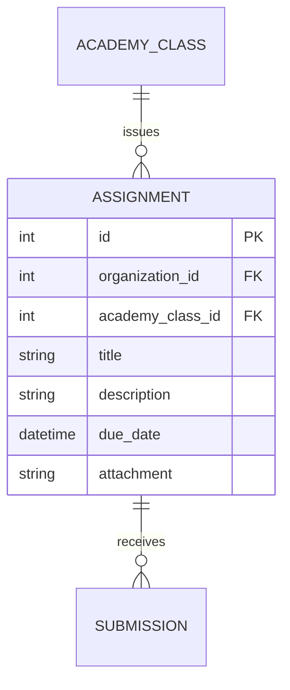
```mermaid
erDiagram
    ASSIGNMENT {
        int id PK
        int organization_id FK
        int academy_class_id FK
        string title
        string description
        datetime due_date
        string attachment
    }
    ACADEMY_CLASS ||--o{ ASSIGNMENT : "issues"
    ASSIGNMENT ||--o{ SUBMISSION : "receives"
```

---

## 3. Lifecycle

1. **Creation**: Created by a teacher, specifying the title, description, class, due date, and attachments.
2. **Submission Window**: Students upload work until the due date.
3. **Archival**: Archived automatically when the class is archived.

---

## Entity: Assignment Submission

The `AssignmentSubmission` entity represents a student's answer or upload for an assigned task.

---

## 1. Purpose

It captures student submissions (files, text), tracks submission timestamps, and stores grades and teacher feedback.

---

## 2. Relationships

An `AssignmentSubmission` connects to:
* **Assignment**: Many-to-one via `assignment` (ForeignKey).
* **User (Student)**: Many-to-one via `student` (ForeignKey).
* **User (Grader)**: Many-to-one via `graded_by` (ForeignKey).

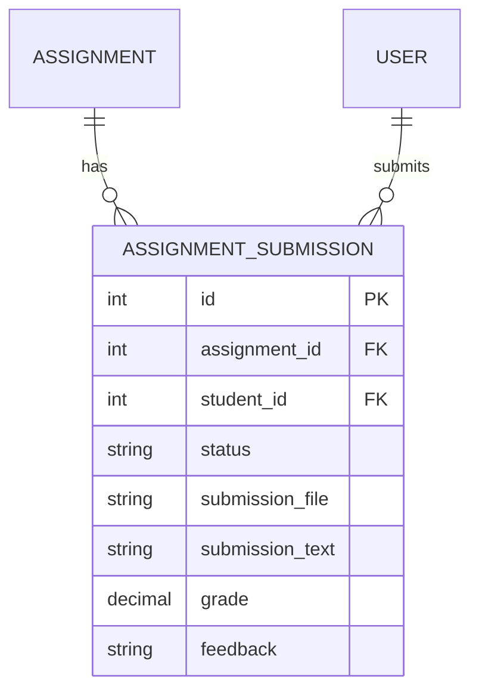
```mermaid
erDiagram
    ASSIGNMENT_SUBMISSION {
        int id PK
        int assignment_id FK
        int student_id FK
        string status
        string submission_file
        string submission_text
        decimal grade
        string feedback
    }
    ASSIGNMENT ||--o{ ASSIGNMENT_SUBMISSION : "has"
    USER ||--o{ ASSIGNMENT_SUBMISSION : "submits"
```

---

## 3. Lifecycle

1. **Submission**: Created when a student uploads a file or saves a text response (status set to `submitted`).
2. **Grading**: The teacher reviews the work, enters a grade and feedback, and updates status to `graded` (setting `graded_by` and `graded_at`).
3. **Revision**: If permitted, the student can upload a revision, reverting the status back to `submitted`.

---

## Entity: Attendance

The `Attendance` entity tracks the presence, punctuality, and engagement of a student in a specific academic `Session`.

---

## 1. Purpose

It records student attendance metrics (present, absent, late, excused) and tracks join/leave timestamps during live classes.

---

## 2. Relationships

An `Attendance` record connects to:
* **Session**: Many-to-one via `session` (ForeignKey).
* **User (Student)**: Many-to-one via `student` (ForeignKey).

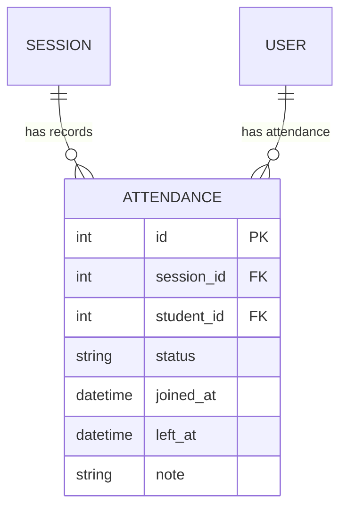
```mermaid
erDiagram
    ATTENDANCE {
        int id PK
        int session_id FK
        int student_id FK
        string status
        datetime joined_at
        datetime left_at
        string note
    }
    SESSION ||--o{ ATTENDANCE : "has records"
    USER ||--o{ ATTENDANCE : "has attendance"
```

---

## 3. Lifecycle

1. **Creation**: When a session starts or completes, blank attendance rows are generated for all enrolled students with the default status `absent`.
2. **Real-time Logging**: If a student joins the WebRTC live room, `joined_at` is set and status updates to `present` or `late`. When they leave, `left_at` is set.
3. **Manual Review**: The teacher reviews and adjusts statuses or notes after the session ends.

---

## Entity: Class

The `AcademyClass` entity represents a specific cohort of students running through a `Course` during a defined time frame, led by a teacher and mentor.

---

## 1. Purpose

It represents the active classroom cohort, facilitating student assignments, live class sessions, grading, and scheduling.

---

## 2. Relationships

An `AcademyClass` connects to:
* **Course**: Many-to-one via `course` (ForeignKey).
* **User (Teacher)**: Many-to-one via `teacher` (ForeignKey).
* **User (Mentor)**: Many-to-one via `mentor` (ForeignKey).
* **Room**: Many-to-one via `room` (ForeignKey).
* **Enrollment**: One-to-many via `enrollments` (reverse relationship).
* **Session**: One-to-many via `sessions` (reverse relationship).
* **Assignment**: One-to-many via `assignments` (reverse relationship).

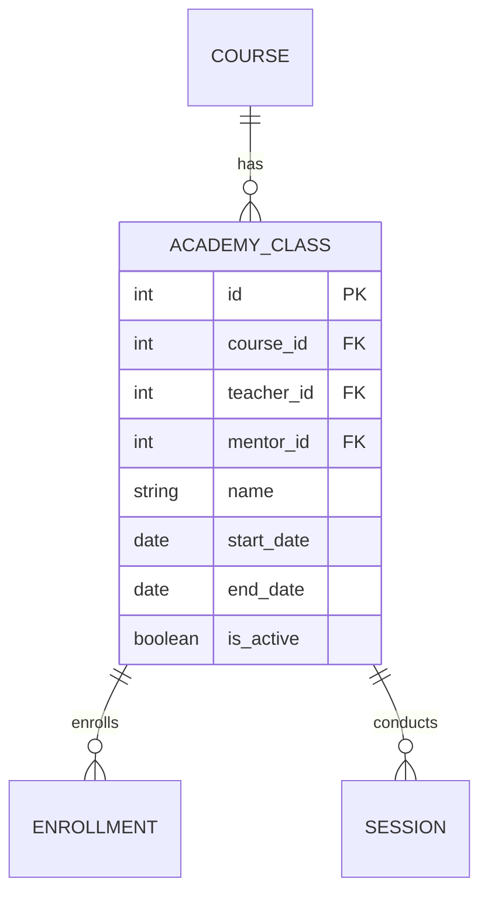
```mermaid
erDiagram
    ACADEMY_CLASS {
        int id PK
        int course_id FK
        int teacher_id FK
        int mentor_id FK
        string name
        date start_date
        date end_date
        boolean is_active
    }
    COURSE ||--o{ ACADEMY_CLASS : "has"
    ACADEMY_CLASS ||--o{ ENROLLMENT : "enrolls"
    ACADEMY_CLASS ||--o{ SESSION : "conducts"
```

---

## 3. Lifecycle

1. **Creation**: Instantiated by an admin, picking a parent Course, naming the cohort, setting start/end dates, and assigning a primary Teacher and Mentor.
2. **Execution**: Active class sessions are scheduled, assignments are distributed, and attendance is marked.
3. **Completion**: When the class end-date passes, student completion status is evaluated and certificates are issued. The class is archived (`is_active = False`).

---

## Entity: Course

The `Course` entity represents the catalog description of a subject or program offered by the organization.

---

## 1. Purpose

It solves the problem of defining curriculum templates and fee structures. It acts as the blueprint from which individual classes are instantiated.

---

## 2. Relationships

A `Course` connects to:
* **Organization**: Many-to-one via `organization` (ForeignKey).
* **AcademyClass**: One-to-many via `classes` (reverse relationship).
* **User (Creator)**: Many-to-one via `created_by` (ForeignKey).

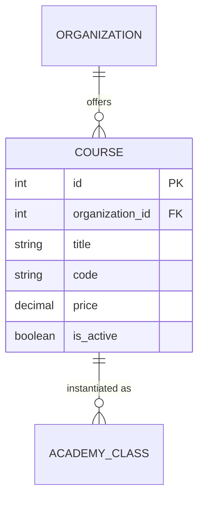
```mermaid
erDiagram
    COURSE {
        int id PK
        int organization_id FK
        string title
        string code
        decimal price
        boolean is_active
    }
    ORGANIZATION ||--o{ COURSE : "offers"
    COURSE ||--o{ ACADEMY_CLASS : "instantiated as"
```

---

## 3. Lifecycle

1. **Creation**: Created by an Organization Admin or Manager. It is assigned a unique code (e.g., `CS101`) and a base price.
2. **Update**: Description, title, price, or thumbnail can be edited.
3. **Archival/Deactivation**: If no longer taught, `is_active` is set to `False` to hide it from new class offerings while keeping historical records intact.

---

## Entity: Dashboard Widgets

The `DashboardWidgets` entity represents the modular layout components rendered on the main dashboard page depending on the user's role and organization status.

---

## 1. Purpose

It ensures that users see role-relevant metrics immediately upon logging in. Admins see member and financial statistics, teachers see grading tasks and schedules, and students see upcoming quizzes and recordings.

---

## 2. Relationships

Widgets are populated by:
* **Academic stats**: Enrolled classes, upcoming sessions, live streams, and assignments.
* **Financial stats**: Invoice status trackers and operational summaries.
* **Student-specific items**: Grade tracker charts, upcoming exams, next up countdown, and the recordings shelf.

---

## 3. Lifecycle

1. **Role Check**: When a user logs in, the frontend queries their organization role context.
2. **Component Mapping**: The frontend Dashboard router loads the corresponding widget panels:
   * **Admin View**: Member listings, billing plan quotas, finance logs.
   * **Teacher View**: Live session launcher, pending submissions grid, upcoming schedules.
   * **Student View**: Grade cards, next up session timer, recordings list.
3. **Real-time updates**: Alerts and notifications trigger dynamic status changes in widgets (e.g., displaying the "Live Now" banner when a session starts).

---

## Entity: Enrollment

The `Enrollment` entity represents the formal registration of a student user into an active `AcademyClass`.

---

## 1. Purpose

It manages student-to-class assignments, tracking student progress, and controlling access permissions to class resources and assignments.

---

## 2. Relationships

An `Enrollment` connects to:
* **AcademyClass**: Many-to-one via `academy_class` (ForeignKey).
* **User (Student)**: Many-to-one via `student` (ForeignKey).
* **User (Enroller)**: Many-to-one via `enrolled_by` (optional ForeignKey to the admin who registered them).

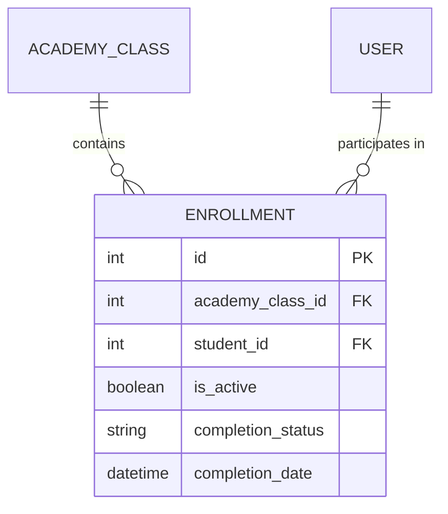
```mermaid
erDiagram
    ENROLLMENT {
        int id PK
        int academy_class_id FK
        int student_id FK
        boolean is_active
        string completion_status
        datetime completion_date
    }
    ACADEMY_CLASS ||--o{ ENROLLMENT : "contains"
    USER ||--o{ ENROLLMENT : "participates in"
```

---

## 3. Lifecycle

1. **Creation**: Created when an Admin registers a Student to a Class. A corresponding `TuitionInvoice` is typically generated automatically.
2. **Update**: Progress status updates from `in_progress` to `completed` or `dropped`.
3. **Deactivation**: If a student drops the class, `is_active` is toggled to `False`.

---

## Entity: Expense

The `ExpenseItem` entity tracks the outlays and payments made by the organization (salaries, servers, rent, utilities).

---

## 1. Purpose

It records operational expenses, handles payout tracking for teachers, and provides transaction logs to generate profit-and-loss balances.

---

## 2. Relationships

An `ExpenseItem` connects to:
* **Organization**: Many-to-one via `organization` (ForeignKey).
* **User (Recipient)**: Many-to-one via `recipient` (optional ForeignKey; e.g., teacher payout recipient).
* **User (Approver)**: Many-to-one via `approved_by` (optional ForeignKey to the admin authorizing the payout).

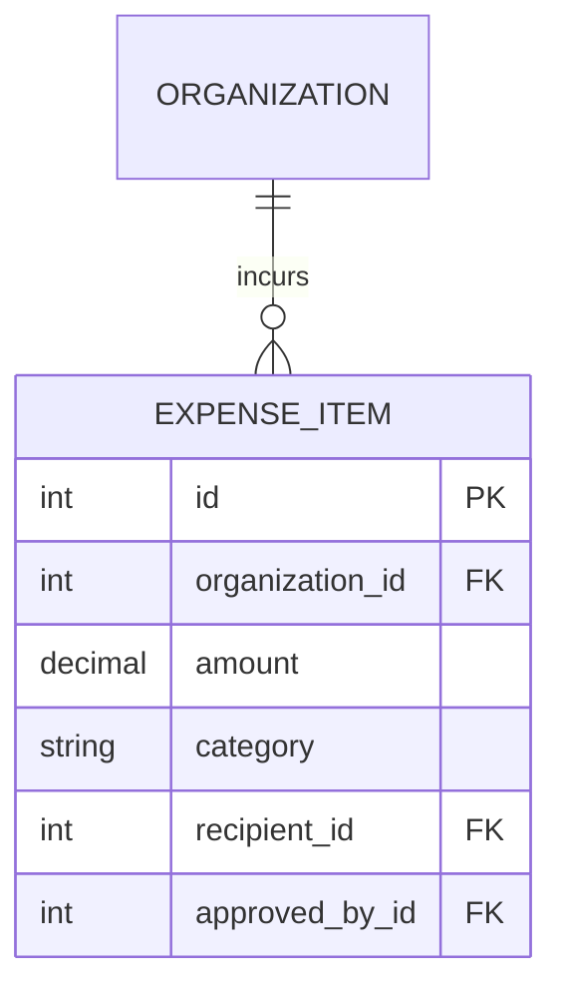
```mermaid
erDiagram
    EXPENSE_ITEM {
        int id PK
        int organization_id FK
        decimal amount
        string category
        int recipient_id FK
        int approved_by_id FK
    }
    ORGANIZATION ||--o{ EXPENSE_ITEM : "incurs"
```

---

## 3. Lifecycle

1. **Creation**: Added manually by an admin, choosing a category (payout, infrastructure, marketing, rent, other), setting the amount, date, and attaching receipts.
2. **Approval**: An admin approves the expense (marking `approved_by` and triggering database updates).
3. **Archival**: Retained permanently in the financial audit history.

---

## Entity: Invoice

The `TuitionInvoice` entity represents a fee or tuition bill issued by the organization to a student.

---

## 1. Purpose

It manages student tuition billing, tracks payments, handles partial payments, and provides raw data for the organization's revenue reports.

---

## 2. Relationships

A `TuitionInvoice` connects to:
* **Organization**: Many-to-one via `organization` (ForeignKey).
* **User (Student)**: Many-to-one via `student` (ForeignKey).
* **AcademyClass**: Many-to-one via `academy_class` (optional ForeignKey linking the bill to a class enrollment).
* **User (Issuer)**: Many-to-one via `issued_by` (optional ForeignKey to the admin who generated the invoice).
* **InvoiceLineItem**: One-to-many via `line_items` (reverse relationship mapping item descriptions and individual pricing).

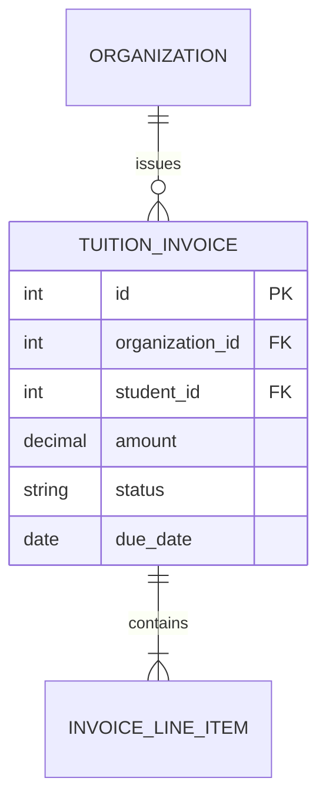
```mermaid
erDiagram
    TUITION_INVOICE {
        int id PK
        int organization_id FK
        int student_id FK
        decimal amount
        string status
        date due_date
    }
    ORGANIZATION ||--o{ TUITION_INVOICE : "issues"
    TUITION_INVOICE ||--|{ INVOICE_LINE_ITEM : "contains"
```

---

## 3. Lifecycle

1. **Issuance**: Automatically generated on class enrollment or manually issued by an admin. The invoice number is populated, and status is set to `unpaid`.
2. **Payment Processing**: The student pays cash/bank-transfer (manually marked by admin) or pays online, changing status to `paid` (or `partial` if not fully paid) and setting `paid_at` and `payment_method`.
3. **Overdue/Cancellation**: If the due date passes, status is set to `overdue`. Bills can also be `cancelled` or `refunded`.

---

## Entity: Invoice Item

The `InvoiceLineItem` entity represents a single breakdown line inside a `TuitionInvoice`.

---

## 1. Purpose

It displays detailed descriptions, quantities, and item prices on student billing statements.

---

## 2. Relationships

An `InvoiceLineItem` connects to:
* **TuitionInvoice**: Many-to-one via `invoice` (ForeignKey).

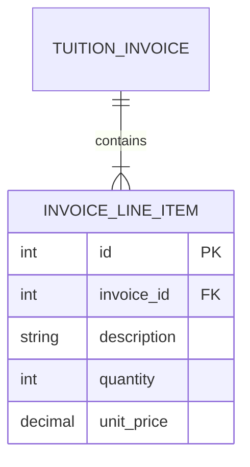
```mermaid
erDiagram
    INVOICE_LINE_ITEM {
        int id PK
        int invoice_id FK
        string description
        int quantity
        decimal unit_price
    }
    TUITION_INVOICE ||--|{ INVOICE_LINE_ITEM : "contains"
```

---

## 3. Lifecycle

1. **Creation**: Saved simultaneously during the creation of a parent `TuitionInvoice`.
2. **Deletion**: Modified or deleted along with the invoice editing flows. Purged automatically if the parent invoice is deleted (cascade delete).

---

## Entity: Ledger Entry

The `LedgerEntry` represents a unified financial transaction record aggregated from both `TuitionInvoice` and `ExpenseItem` models.

---

## 1. Purpose

It provides a single transaction ledger dashboard inside `/finance/ledger` to display incoming revenue (paid invoices) and outgoing costs (approved expenses) in chronological order.

---

## 2. Relationships

A `LedgerEntry` acts as a polymorphic record derived from:
* **TuitionInvoice** (Credit / Incoming)
* **ExpenseItem** (Debit / Outgoing)

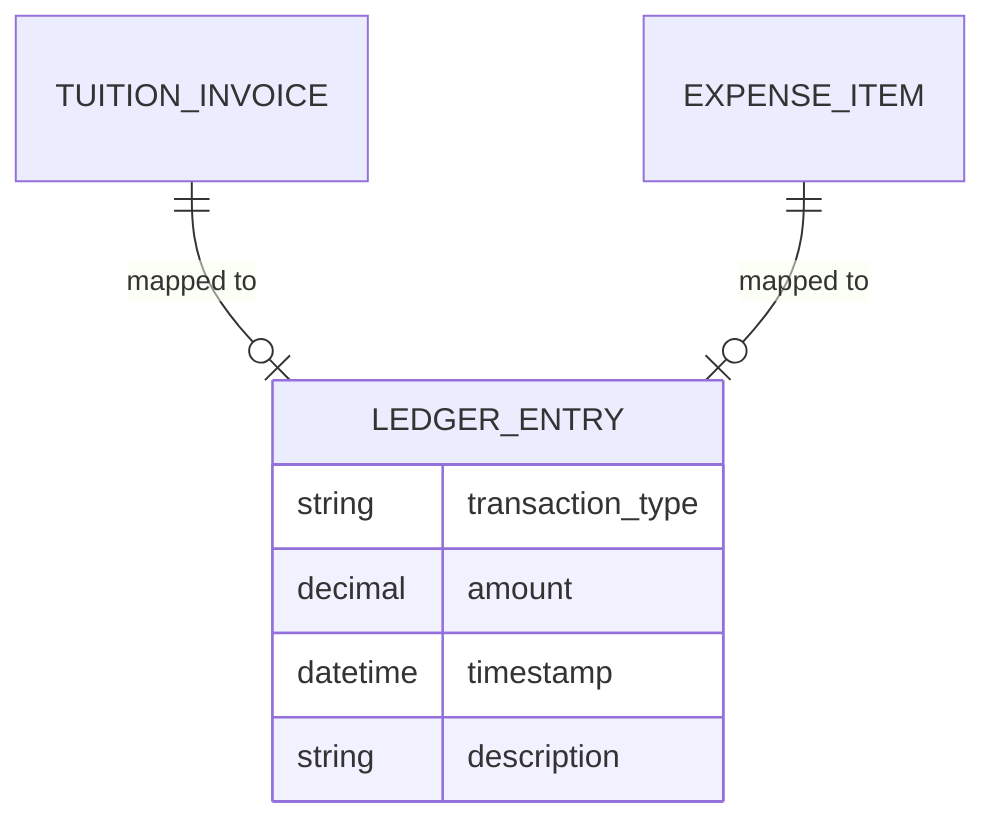
```mermaid
erDiagram
    LEDGER_ENTRY {
        string transaction_type
        decimal amount
        datetime timestamp
        string description
    }
    TUITION_INVOICE ||--o| LEDGER_ENTRY : "mapped to"
    EXPENSE_ITEM ||--o| LEDGER_ENTRY : "mapped to"
```

---

## 3. Lifecycle

1. **Aggregation**: Computed dynamically in the backend (e.g., via `/api/auth/finance/summary/`) or assembled in frontend state.
2. **Display**: Sorted by `created_at` or `incurred_at` timestamps.
3. **Filtering**: Filtered by date range, category, status, or transaction type to analyze net operational cash flows.

---

## Entity: Live Room

The `Room` entity (referred to as Live Room) represents an active WebRTC virtual classroom session powered by LiveKit.

---

## 1. Purpose

It enables real-time audio/video streaming, screen-sharing, class chats, whiteboard collaboration, and interactive educational miniapps.

---

## 2. Relationships

A `Room` connects to:
* **User (Host)**: Many-to-one via `host` (ForeignKey).
* **Session**: Many-to-one via `session` (optional ForeignKey linking it to an academic schedule).
* **Organization**: Many-to-one via `organization` (optional ForeignKey).
* **RoomParticipant**: One-to-many via `participants` (reverse relationship mapping current active users).
* **User (Recording Delegate)**: Many-to-many via `recording_grants` (authorizing specific users to control recording triggers).
* **Recording**: One-to-many via `recordings` (reverse relationship).

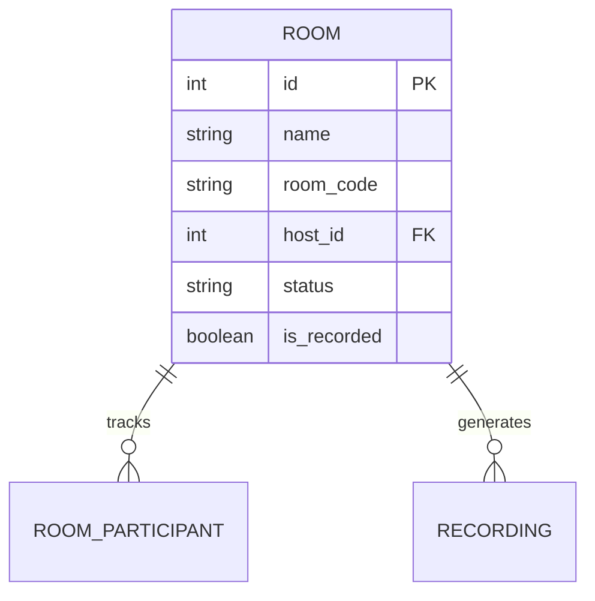
```mermaid
erDiagram
    ROOM {
        int id PK
        string name
        string room_code
        int host_id FK
        string status
        boolean is_recorded
    }
    ROOM ||--o{ ROOM_PARTICIPANT : "tracks"
    ROOM ||--o{ RECORDING : "generates"
```

---

## 3. Lifecycle

1. **Initialization**: Spawned with status `waiting` when a scheduled session starts or an ad-hoc room is created.
2. **Activation**: Transitions to `active` when the host logs in. Participants join, and WebSocket handlers publish live events.
3. **Termination**: When the host ends the call, status is set to `ended`, `ended_at` is marked, and participants are disconnected.

---

## Entity: Membership

The `OrgMember` entity acts as the join table connecting a `User` to an `Organization` with a specific `Role`.

---

## 1. Purpose

It enables multi-tenant user mapping. It specifies which organization a user belongs to, what their contract type is (full-time, part-time, guest, contractor), and what role they hold within that tenant.

---

## 2. Relationships

An `OrgMember` connects to:
* **Organization**: Many-to-one via `organization` (ForeignKey).
* **User**: Many-to-one via `user` (ForeignKey).
* **Role**: Many-to-one via `role` (ForeignKey, SET_NULL on delete).

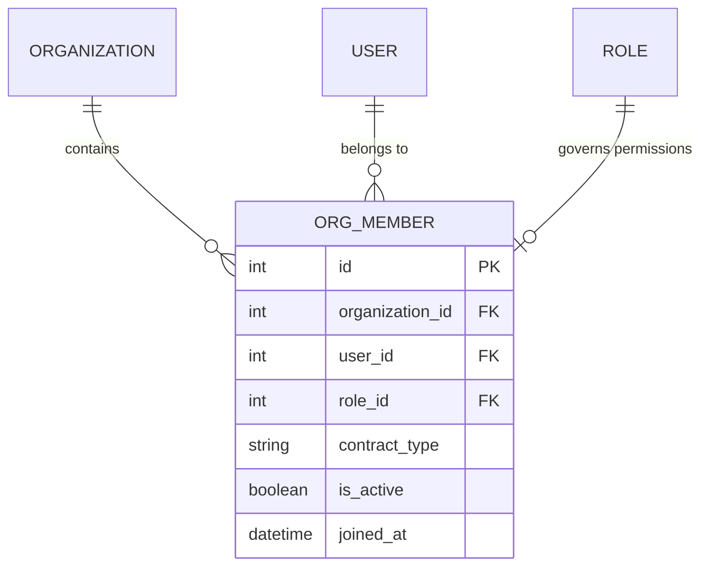
```mermaid
erDiagram
    ORG_MEMBER {
        int id PK
        int organization_id FK
        int user_id FK
        int role_id FK
        string contract_type
        boolean is_active
        datetime joined_at
    }
    ORGANIZATION ||--o{ ORG_MEMBER : "contains"
    USER ||--o{ ORG_MEMBER : "belongs to"
    ROLE ||--o| ORG_MEMBER : "governs permissions"
```

---

## 3. Lifecycle

1. **Creation**: An administrator invites a user or adds them to the organization. This creates the membership and assigns a role.
2. **Update**: An admin can update the member's role (e.g., promoting a Teacher to Admin), contract type, or expiration date.
3. **Deactivation**: Instead of deleting records, terminating a membership is done by setting `is_active = False` to preserve historical logs, course analytics, and financial invoice details.

---

## Entity: Mentor

# Persona Entity: Mentor

The `Mentor` entity represents a supporting tutor or class assistant who monitors sessions and supports students.

---

## 1. Purpose

It enables teaching assistance and passive class monitoring, allowing tutors to help students without having permission to edit financial data or alter official class settings.

---

## 2. Relationships

A `Mentor` connects to:
* **User**: Associated via `OrgMember` role mapping (`role.name = 'Mentor'`).
* **AcademyClass**: Assigned as `mentor` (ForeignKey) on zero or more classes.

---

## 3. Lifecycle

1. **Assignment**: Invited to the organization with the `Mentor` role and assigned to support specific classes.
2. **Support**: Joins live rooms, answers student chat questions, views attendance logs, and tracks student grade summaries.
3. **Revocation**: Reassigned to other classes or deactivated by an administrator.

---

## Entity: Notification

The `Notification` entity represents a system alert or reminder delivered to a specific user.

---

## 1. Purpose

It manages asynchronous communication. It captures room invites, published recordings, custom broadcasts, and invoice alerts, storing them so users can view them even if they were offline when the event occurred.

---

## 2. Relationships

A `Notification` connects to:
* **User**: Many-to-one via `user` (ForeignKey).

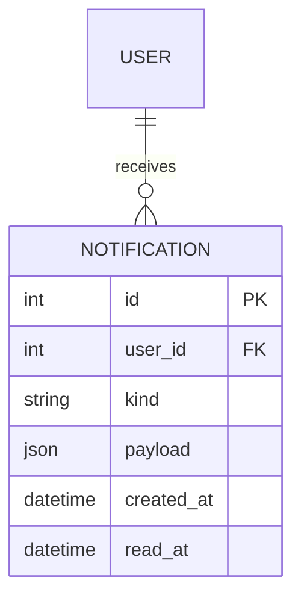
```mermaid
erDiagram
    NOTIFICATION {
        int id PK
        int user_id FK
        string kind
        json payload
        datetime created_at
        datetime read_at
    }
    USER ||--o{ NOTIFICATION : "receives"
```

---

## 3. Lifecycle

1. **Creation**: Triggered by backend actions (e.g., publishing a recording, broadcasting a classroom announcement, or inviting a student to a room). A database row is created.
2. **Push Delivery**: Dispatched immediately via WebSockets if the user has an active online connection.
3. **Read Acknowledgement**: Toggled when the user clicks "mark as read" on the notification list, setting `read_at` to the current timestamp.
4. **Purge**: Deleted manually by the user or automatically pruned after retention periods pass.

---

## Entity: Organization

The `Organization` entity represents the top-level tenant in the multi-tenant SaaS architecture. All courses, classes, financial transactions, settings, and memberships are scoped to an organization.

---

## 1. Purpose

It solves the problem of tenant separation. It isolates data, dashboards, configurations, subscription billing, and user spaces so that multiple educational institutions can use the platform securely without cross-tenant leakage.

---

## 2. Relationships

An `Organization` connects to:
* **User (Owner)**: One-to-many relationship via `owner` (ForeignKey to `User`).
* **OrgMember**: One-to-many via `members` (reverse relationship).
* **Role**: One-to-many via `custom_roles` (reverse relationship).
* **Course**: One-to-many via `courses` (reverse relationship).
* **Session**: One-to-many via `sessions` (reverse relationship).
* **TuitionInvoice**: One-to-many via `invoices` (reverse relationship).
* **ExpenseItem**: One-to-many via `expenses` (reverse relationship).
* **OrganizationSubscription**: One-to-one via `subscription` (reverse relationship).

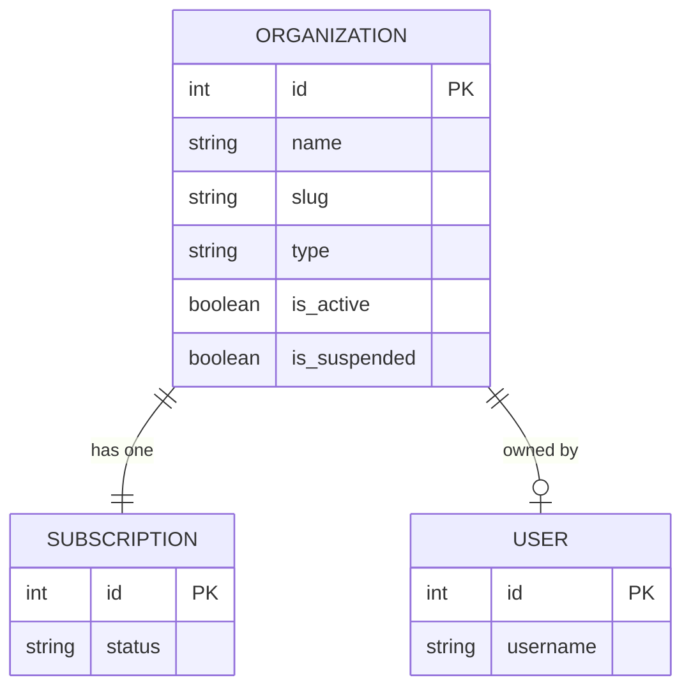
```mermaid
erDiagram
    ORGANIZATION {
        int id PK
        string name
        string slug
        string type
        boolean is_active
        boolean is_suspended
    }
    USER {
        int id PK
        string username
    }
    SUBSCRIPTION {
        int id PK
        string status
    }
    ORGANIZATION ||--|| SUBSCRIPTION : "has one"
    ORGANIZATION ||--o| USER : "owned by"
```

---

## 3. Lifecycle

1. **Creation**: Created by a user registering an institution. A slug is generated, and the creating user is designated as the `owner`. A Stripe checkout is initiated to establish the `OrganizationSubscription` record.
2. **Update**: The owner or an admin can update the name, logo, and general details.
3. **Suspension**: Can be suspended by a superuser (`is_suspended = True`, `suspended_at` is set) for non-payment or violations. This locks all member logins under the tenant.
4. **Archival/Deletion**: Soft deletion is supported via `is_active = False` or suspension. Full deletion requires purging related DB records in a cascade.

---

## Entity: Permission

The `Permission` entity represents a specific action that a user is allowed to perform on the platform.

---

## 1. Purpose

It acts as the atomic unit of the Role-Based Access Control (RBAC) system.

---

## 2. Relationships

A `Permission` connects to:
* **Role**: Many-to-many via `role_set` (reverse relationship).

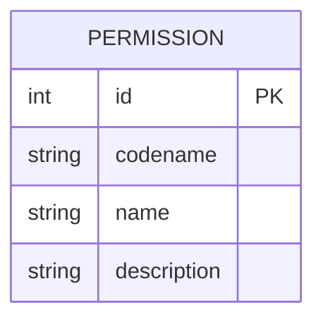
```mermaid
erDiagram
    PERMISSION {
        int id PK
        string codename
        string name
        string description
    }
```

---

## 3. Lifecycle

1. **Creation**: Permissions are predefined by system developers and created during initial migration/seeding. They are immutable from the user interface.
2. **Evaluation**: Checked dynamically in the backend using `has_org_permission(user, org, codename)` and in the frontend routing guards.
3. **Archival/Deletion**: Deletion is only done during system updates or migration rollbacks.

---

## Entity: Recording

The `Recording` entity represents a WebRTC session capture recording produced by the LiveKit Egress service.

---

## 1. Purpose

It manages classroom recordings, coordinates multi-segment recordings (handling stream pause/resume events), enables host video trimming and sharing, and tracks student viewing engagement.

---

## 2. Relationships

A `Recording` connects to:
* **Room**: Many-to-one via `room` (ForeignKey).
* **Session**: Many-to-one via `session` (optional ForeignKey).
* **User (Owner)**: Many-to-one via `owner` (ForeignKey referencing the teacher/host).
* **User (Viewer)**: Many-to-many via `visible_to` (defining the specific students who have viewing access).
* **RecordingSegment**: One-to-many via `segments` (reverse relationship mapping pause/resume chunk files).
* **RecordingView**: One-to-many via `views` (reverse relationship logging audience engagement telemetry).

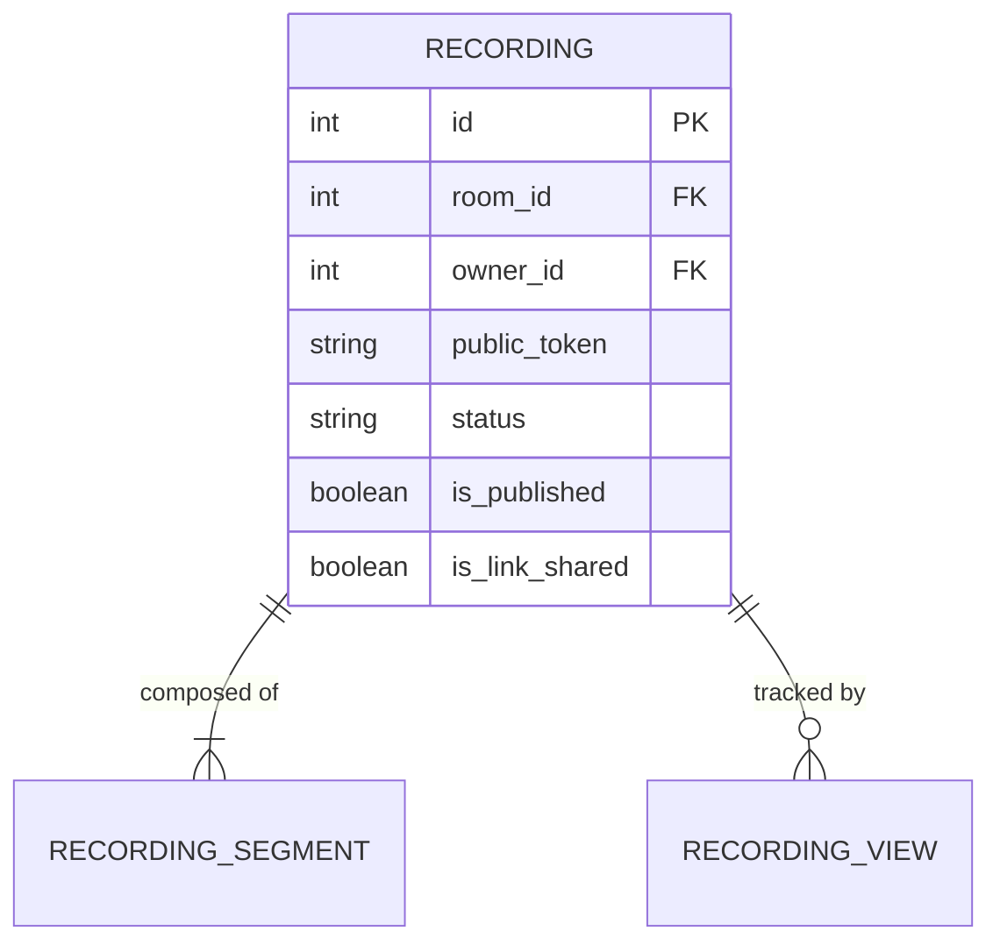
```mermaid
erDiagram
    RECORDING {
        int id PK
        int room_id FK
        int owner_id FK
        string public_token
        string status
        boolean is_published
        boolean is_link_shared
    }
    RECORDING ||--|{ RECORDING_SEGMENT : "composed of"
    RECORDING ||--o{ RECORDING_VIEW : "tracked by"
```

---

## 3. Lifecycle

1. **Trigger**: Initiated during a WebRTC call by the host. A `Recording` row is created with status `starting`.
2. **Recording & Pauses**: Egress worker records data. If paused, a new segment is created upon resume. Status moves between `recording` and `paused`.
3. **Muxing**: When stopped, status moves to `processing`, and segments are stitched together. On completion, `file_path`, size, and duration are set, status becomes `completed`.
4. **Publishing & Sharing**: The host trims boundaries (`trim_start_seconds`, `trim_end_seconds`) and sets `is_published = True`. Sharing settings are configured.
5. **Soft Deletion**: Moving `is_deleted = True` hides the recording from listings but preserves rows for audit logs.

---

## Entity: Role

The `Role` entity defines a set of permissions. It can be system-wide (global roles like Admin, Teacher, Student, Mentor) or custom to an organization.

---

## 1. Purpose

It groups individual permissions into logical clusters to simplify user access control management.

---

## 2. Relationships

A `Role` connects to:
* **Organization**: Many-to-one via `organization` (optional; null for global roles, defined for tenant-specific roles).
* **Permission**: Many-to-many via `permissions` (defining the capabilities granted by the role).
* **OrgMember**: One-to-many via `orgmember_set` (assigning the role to memberships).

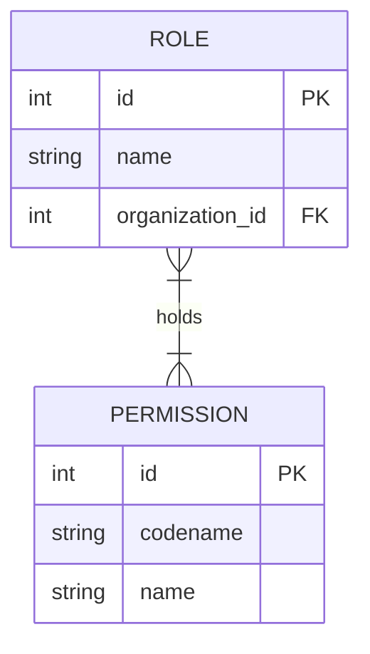
```mermaid
erDiagram
    ROLE {
        int id PK
        string name
        int organization_id FK
    }
    PERMISSION {
        int id PK
        string codename
        string name
    }
    ROLE }|--|{ PERMISSION : "holds"
```

---

## 3. Lifecycle

1. **Creation**: Global roles are seeded during database setup. Custom roles can be created by organization admins via the settings panel.
2. **Update**: Admins can edit the permissions mapped to custom roles.
3. **Deletion**: Deleting a custom role will set the `role` field on related `OrgMember` instances to `None` (null).

---

## Entity: Session

The `Session` entity represents an individual class meeting or lecture event, which can be scheduled, active (live), or completed.

---

## 1. Purpose

It manages session schedules, prevents teacher/room booking overlaps, serves as the launcher for live WebRTC video rooms, and tracks attendance.

---

## 2. Relationships

A `Session` connects to:
* **AcademyClass**: Many-to-one via `academy_class` (optional ForeignKey; null for ad-hoc meetings).
* **Organization**: Many-to-one via `organization` (ForeignKey).
* **User (Host)**: Many-to-one via `host` (ForeignKey).
* **Room (Active Room)**: Many-to-one via `active_room` (ForeignKey pointing to the active room context).
* **Attendance**: One-to-many via `attendance_records` (reverse relationship).
* **Assessment**: One-to-many via `assessments` (reverse relationship).
* **Recording**: One-to-many via `recordings` (reverse relationship).

```mermaid
erDiagram
    SESSION {
        int id PK
        int academy_class_id FK
        int organization_id FK
        int host_id FK
        int active_room_id FK
        string title
        datetime scheduled_start
        datetime scheduled_end
        string status
    }
    ACADEMY_CLASS ||--o{ SESSION : "schedules"
    SESSION ||--o{ ATTENDANCE : "tracks"
    SESSION ||--o| ROOM : "spawns"
```

---

## 3. Lifecycle

1. **Scheduling**: Created with status `scheduled` by an admin or teacher, setting start/end times, verifying host and room availability.
2. **Going Live**: Transitioned to `live` (via `start_live()`) when the teacher launches the session. This creates/attaches an active WebRTC `Room`.
3. **Completion**: Transitioned to `completed` (via `complete()`) when the host ends the call. A webhook triggers the stitching of recordings, and attendance forms are finalized.

---

## Entity: Student

# Persona Entity: Student

The `Student` entity is the primary consumer of learning content on the platform.

---

## 1. Purpose

It scopes the user interface to student-specific tasks: joining live video streams, reviewing grades, submitting homework assignments, taking online quizzes, and reviewing invoices.

---

## 2. Relationships

A `Student` connects to:
* **User**: Associated via `OrgMember` role mapping (`role.name = 'Student'`).
* **Enrollment**: Linked through `Enrollment` tables to their active classes.
* **TuitionInvoice**: Recipient of class fee invoices.
* **Submission / AssignmentSubmission**: Author of quiz attempts and homework uploads.

---

## 3. Lifecycle

1. **Onboarding**: Registered by an admin or self-registered and enrolled into a class.
2. **Participation**: Attends live sessions, submits homework, answers quizzes, and views grades.
3. **Completion**: Upon finishing the class, they receive a Certificate or complete their course program.

---

## Entity: Teacher

# Persona Entity: Teacher

The `Teacher` entity is a role-scoped persona representing the academic instructor of the platform.

---

## 1. Purpose

It grants access to lecture delivery, whiteboard tools, classroom management, student assessment grading, and attendance tracking.

---

## 2. Relationships

A `Teacher` connects to:
* **User**: Associated via `OrgMember` role mapping (`role.name = 'Teacher'`).
* **AcademyClass**: Assigned as `teacher` (ForeignKey) on zero or more classes.
* **Session**: Assigned as the `host` (ForeignKey) on academic lectures.
* **Recording**: Associated as the creator (`owner_id`) of room stream recordings.
* **Submission / AssignmentSubmission**: Linked as the grader (`graded_by_id`).

---

## 3. Lifecycle

1. **Assignment**: A user is added to an organization as a `Teacher` role. They are subsequently assigned as the primary teacher of one or more classes.
2. **Execution**: The teacher schedules sessions, launches live rooms, leads lectures, runs interactive classroom games, marks student attendance, and grades assignments.
3. **Deactivation**: If their contract terminates, the admin deactivates their membership or reassigns their active classes to another teacher.

---

## Entity: User

The `User` entity represents an individual person registered on the platform. It inherits from Django's `AbstractUser` and extends it with profile metadata.

---

## 1. Purpose

It handles authentication, credentials, profiles, global platform authorization (superuser/staff), and multi-tenant mapping across organizations.

---

## 2. Relationships

A `User` connects to:
* **OrgMember**: One-to-many via `org_memberships` (defining their roles inside specific organizations).
* **Organization (Owned)**: One-to-many via `owned_organizations` (as the creator/owner).
* **AcademyClass (Teacher/Mentor)**: One-to-many via `teaching_classes` or `mentored_classes`.
* **Enrollment**: One-to-many via `enrollments` (as a student).
* **Submission**: One-to-many via `submissions` (taking assessments).
* **AssignmentSubmission**: One-to-many via `assignment_submissions` (submitting homework).
* **Recording**: One-to-many via `recordings` (as the host/creator).
* **Notification**: One-to-many via `notifications` (as the recipient).

```mermaid
erDiagram
    USER {
        int id PK
        string username
        string email
        string full_name
        boolean is_active
        boolean is_staff
        boolean is_superuser
    }
    ORG_MEMBER {
        int id PK
        int user_id FK
        int organization_id FK
        int role_id FK
    }
    USER ||--o{ ORG_MEMBER : "has memberships"
```

---

## 3. Lifecycle

1. **Creation**: Created via the `/register` endpoint or by an Admin creating a new user. The default password is set and hashed.
2. **Profile Completion**: The user logs in and updates their avatar, notification preferences, or password.
3. **Suspension/Activation**: The account can be deactivated via `is_active = False` by a platform admin or automatic audit triggers.
4. **Archival/Purge**: Supports GDPR-compliant self-deletion (`/api/auth/privacy/delete-account/`), which cleans up personal identifiers or fully purges the record.

---
