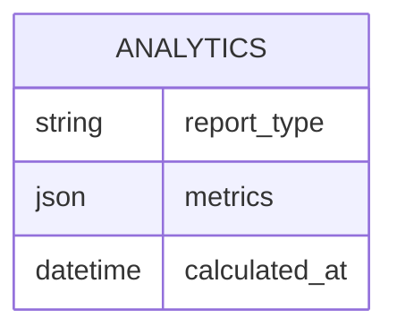

# Entity: Analytics

The `Analytics` represents structured views and reporting metrics calculated from academic and transactional database tables.

---

## 1. Purpose

It aggregates raw data into reports (e.g. class attendance rates, student grades, institution financial trends) to help administrators and teachers evaluate institution performance.

---

## 2. Relationships

Analytics are calculated from:
* **Enrollment / Attendance**: Cohort participation rates.
* **Submission / AssignmentSubmission**: Score distributions, homework completion metrics, and grade curves.
* **TuitionInvoice / ExpenseItem**: Profit-and-loss balances, invoice collection stats, and operational overhead metrics.

---

## 3. Lifecycle

1. **Aggregation**: Computed dynamically in the backend (via `analytics/views.py` endpoints) using Django query filters and aggregates (`Avg`, `Sum`, `Count`).
2. **Export**: Rendered as charts on the admin dashboard, or exported as CSV/Excel reports (via `/api/analytics/reports/export/`).
