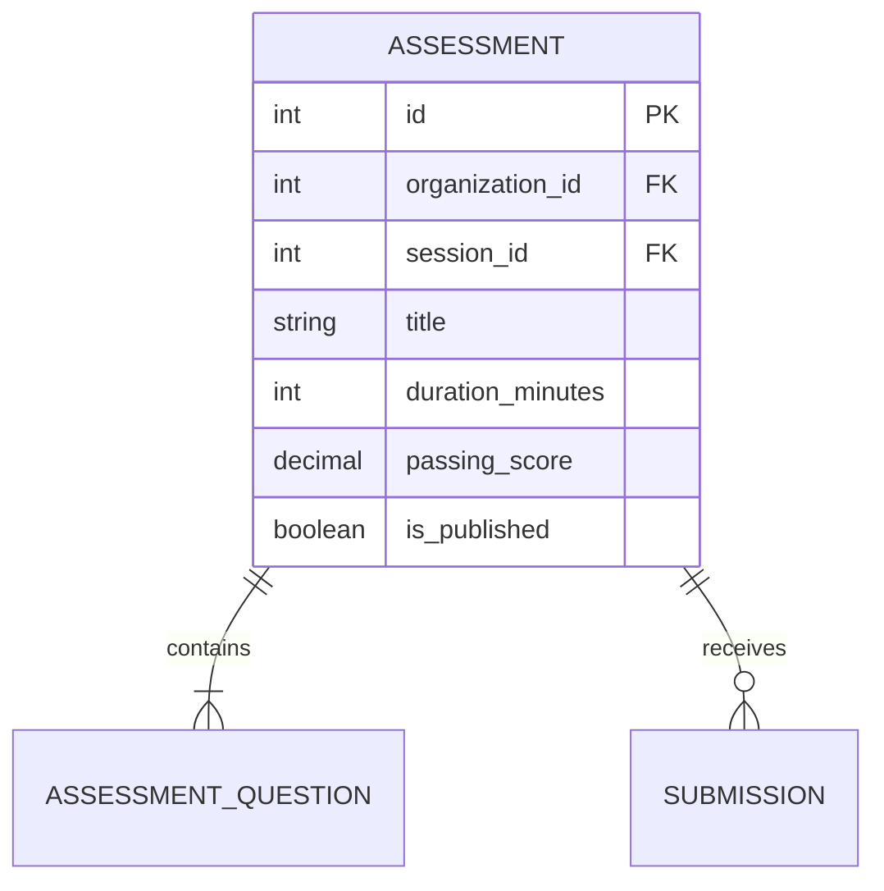

# Entity: Assessment

The `Assessment` entity represents an exam, quiz, or test scheduled for students.

---

## 1. Purpose

It enables formal student evaluations, question-pool management, structured timing parameters, and automated or manual grading.

---

## 2. Relationships

An `Assessment` connects to:
* **Organization**: Many-to-one via `organization` (ForeignKey).
* **Session**: Many-to-one via `session` (optional ForeignKey linking it to a lecture).
* **Question**: Many-to-many via `questions` (through `AssessmentQuestion` mapping order and individual point allocations).
* **Submission**: One-to-many via `submissions` (reverse relationship).

---

## 3. Lifecycle

1. **Composition**: A teacher or admin creates the assessment shell, adding questions from the `QuestionBank` via the `AssessmentQuestion` helper table.
2. **Publishing**: Toggled to `is_published = True`, making it visible to enrolled students on their portals.
3. **Attempt Phase**: Students take the test under time limits.
4. **Grading**: Submissions are graded, and final scores are posted.
