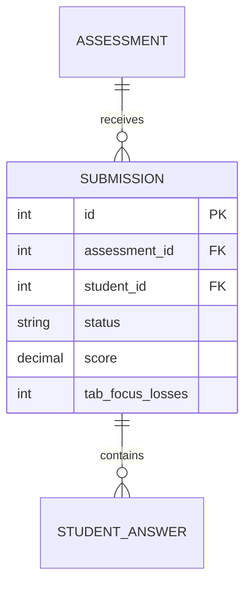

# Entity: Assessment Attempt (Submission)

The `Submission` entity (referred to as Assessment Attempt) represents a student's answer sheet and telemetry log for a specific exam.

---

## 1. Purpose

It captures individual student quiz submissions, logs anti-cheat telemetry (tab focus losses, IP tracking, browser signatures), and records question grading cards.

---

## 2. Relationships

A `Submission` connects to:
* **Assessment**: Many-to-one via `assessment` (ForeignKey).
* **User (Student)**: Many-to-one via `student` (ForeignKey).
* **User (Grader)**: Many-to-one via `graded_by` (ForeignKey).
* **StudentAnswer**: One-to-many via `answers` (reverse relationship mapping student answers to individual questions).

---

## 3. Lifecycle

1. **Initiation**: When a student clicks "Start Quiz", a `Submission` row is created with status `started`, starting a countdown timer based on `duration_minutes`.
2. **Submission**: When the student finishes or the timer expires, the status moves to `submitted`, locking further answers. Anti-cheat metrics are summarized.
3. **Grading**: Standard questions are auto-graded. Short-answer/text answers are manually scored by the teacher, status changes to `graded`, and the final score is set.
