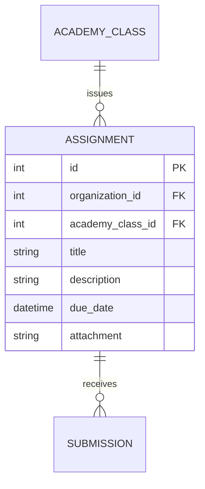

# Entity: Assignment

The `Assignment` entity represents a homework task or project assigned to a class.

---

## 1. Purpose

It enables homework distribution, instruction sharing, due-date enforcement, and student submission tracking.

---

## 2. Relationships

An `Assignment` connects to:
* **Organization**: Many-to-one via `organization` (ForeignKey).
* **AcademyClass**: Many-to-one via `academy_class` (ForeignKey).
* **User (Creator)**: Many-to-one via `created_by` (ForeignKey).
* **AssignmentSubmission**: One-to-many via `submissions` (reverse relationship).

---

## 3. Lifecycle

1. **Creation**: Created by a teacher, specifying the title, description, class, due date, and attachments.
2. **Submission Window**: Students upload work until the due date.
3. **Archival**: Archived automatically when the class is archived.
