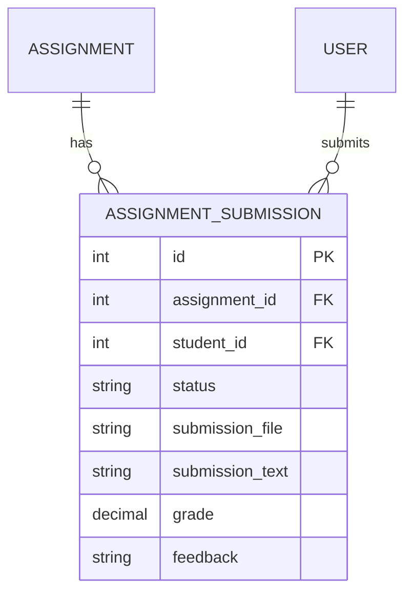

# Entity: Assignment Submission (AssignmentSubmission)

The `AssignmentSubmission` entity represents a student's answer or upload for an assigned task.

---

## 1. Purpose

It captures student submissions (files, text), tracks submission timestamps, and stores grades and teacher feedback.

---

## 2. Relationships

An `AssignmentSubmission` connects to:
* **Assignment**: Many-to-one via `assignment` (ForeignKey).
* **User (Student)**: Many-to-one via `student` (ForeignKey).
* **User (Grader)**: Many-to-one via `graded_by` (ForeignKey).

---

## 3. Lifecycle

1. **Submission**: Created when a student uploads a file or saves a text response (status set to `submitted`).
2. **Grading**: The teacher reviews the work, enters a grade and feedback, and updates status to `graded` (setting `graded_by` and `graded_at`).
3. **Revision**: If permitted, the student can upload a revision, reverting the status back to `submitted`.
