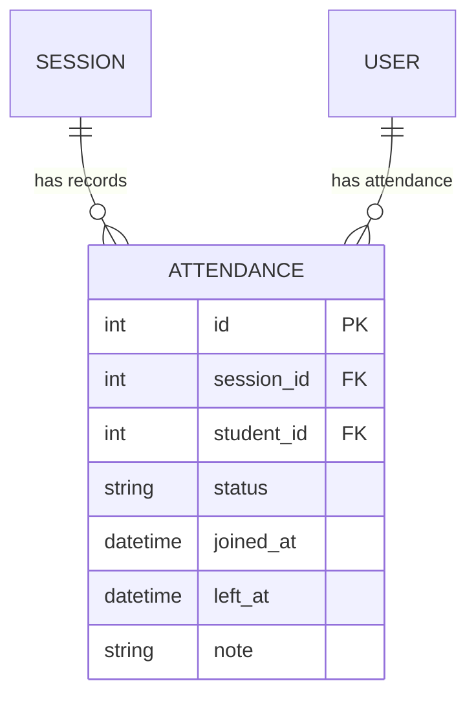

# Entity: Attendance

The `Attendance` entity tracks the presence, punctuality, and engagement of a student in a specific academic `Session`.

---

## 1. Purpose

It records student attendance metrics (present, absent, late, excused) and tracks join/leave timestamps during live classes.

---

## 2. Relationships

An `Attendance` record connects to:
* **Session**: Many-to-one via `session` (ForeignKey).
* **User (Student)**: Many-to-one via `student` (ForeignKey).

---

## 3. Lifecycle

1. **Creation**: When a session starts or completes, blank attendance rows are generated for all enrolled students with the default status `absent`.
2. **Real-time Logging**: If a student joins the WebRTC live room, `joined_at` is set and status updates to `present` or `late`. When they leave, `left_at` is set.
3. **Manual Review**: The teacher reviews and adjusts statuses or notes after the session ends.
