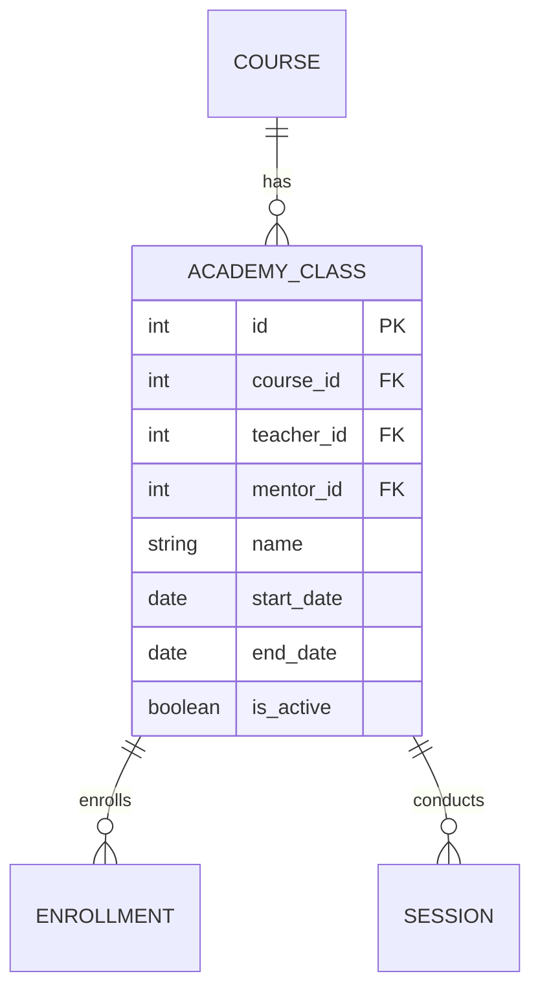

# Entity: Class (AcademyClass)

The `AcademyClass` entity represents a specific cohort of students running through a `Course` during a defined time frame, led by a teacher and mentor.

---

## 1. Purpose

It represents the active classroom cohort, facilitating student assignments, live class sessions, grading, and scheduling.

---

## 2. Relationships

An `AcademyClass` connects to:
* **Course**: Many-to-one via `course` (ForeignKey).
* **User (Teacher)**: Many-to-one via `teacher` (ForeignKey).
* **User (Mentor)**: Many-to-one via `mentor` (ForeignKey).
* **Room**: Many-to-one via `room` (ForeignKey).
* **Enrollment**: One-to-many via `enrollments` (reverse relationship).
* **Session**: One-to-many via `sessions` (reverse relationship).
* **Assignment**: One-to-many via `assignments` (reverse relationship).

---

## 3. Lifecycle

1. **Creation**: Instantiated by an admin, picking a parent Course, naming the cohort, setting start/end dates, and assigning a primary Teacher and Mentor.
2. **Execution**: Active class sessions are scheduled, assignments are distributed, and attendance is marked.
3. **Completion**: When the class end-date passes, student completion status is evaluated and certificates are issued. The class is archived (`is_active = False`).
