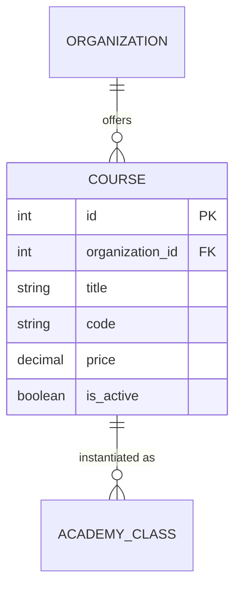

# Entity: Course

The `Course` entity represents the catalog description of a subject or program offered by the organization.

---

## 1. Purpose

It solves the problem of defining curriculum templates and fee structures. It acts as the blueprint from which individual classes are instantiated.

---

## 2. Relationships

A `Course` connects to:
* **Organization**: Many-to-one via `organization` (ForeignKey).
* **AcademyClass**: One-to-many via `classes` (reverse relationship).
* **User (Creator)**: Many-to-one via `created_by` (ForeignKey).

---

## 3. Lifecycle

1. **Creation**: Created by an Organization Admin or Manager. It is assigned a unique code (e.g., `CS101`) and a base price.
2. **Update**: Description, title, price, or thumbnail can be edited.
3. **Archival/Deactivation**: If no longer taught, `is_active` is set to `False` to hide it from new class offerings while keeping historical records intact.
