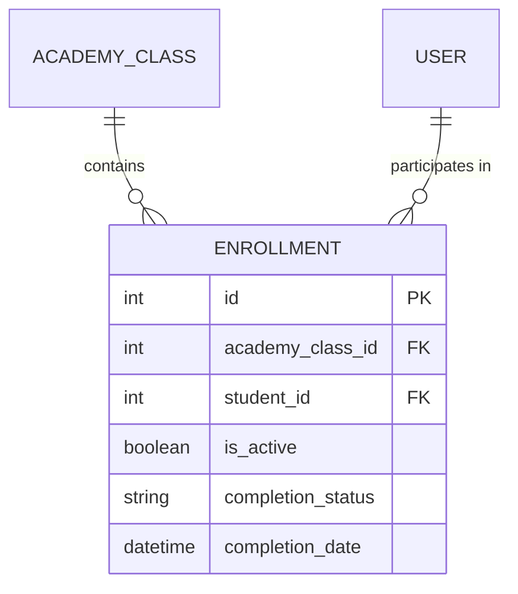

# Entity: Enrollment

The `Enrollment` entity represents the formal registration of a student user into an active `AcademyClass`.

---

## 1. Purpose

It manages student-to-class assignments, tracking student progress, and controlling access permissions to class resources and assignments.

---

## 2. Relationships

An `Enrollment` connects to:
* **AcademyClass**: Many-to-one via `academy_class` (ForeignKey).
* **User (Student)**: Many-to-one via `student` (ForeignKey).
* **User (Enroller)**: Many-to-one via `enrolled_by` (optional ForeignKey to the admin who registered them).

---

## 3. Lifecycle

1. **Creation**: Created when an Admin registers a Student to a Class. A corresponding `TuitionInvoice` is typically generated automatically.
2. **Update**: Progress status updates from `in_progress` to `completed` or `dropped`.
3. **Deactivation**: If a student drops the class, `is_active` is toggled to `False`.
