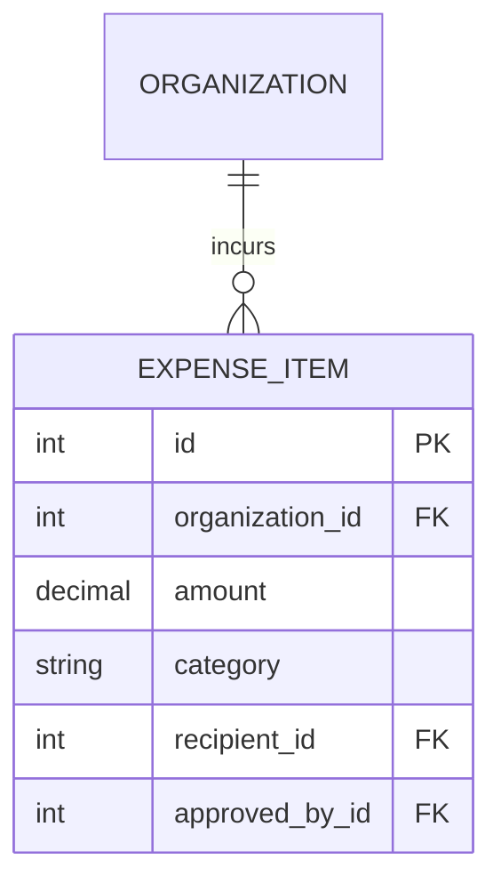

# Entity: Expense (ExpenseItem)

The `ExpenseItem` entity tracks the outlays and payments made by the organization (salaries, servers, rent, utilities).

---

## 1. Purpose

It records operational expenses, handles payout tracking for teachers, and provides transaction logs to generate profit-and-loss balances.

---

## 2. Relationships

An `ExpenseItem` connects to:
* **Organization**: Many-to-one via `organization` (ForeignKey).
* **User (Recipient)**: Many-to-one via `recipient` (optional ForeignKey; e.g., teacher payout recipient).
* **User (Approver)**: Many-to-one via `approved_by` (optional ForeignKey to the admin authorizing the payout).

---

## 3. Lifecycle

1. **Creation**: Added manually by an admin, choosing a category (payout, infrastructure, marketing, rent, other), setting the amount, date, and attaching receipts.
2. **Approval**: An admin approves the expense (marking `approved_by` and triggering database updates).
3. **Archival**: Retained permanently in the financial audit history.
