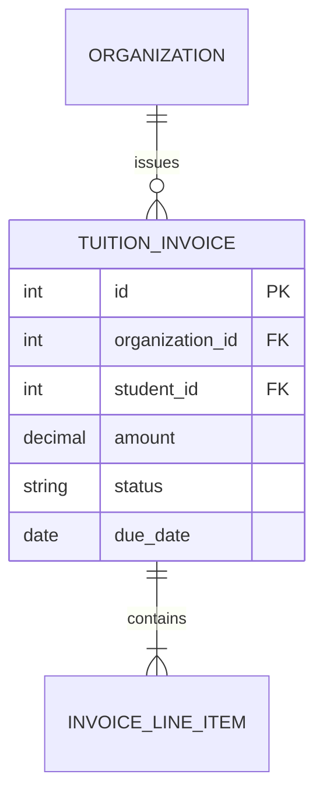

# Entity: Invoice (TuitionInvoice)

The `TuitionInvoice` entity represents a fee or tuition bill issued by the organization to a student.

---

## 1. Purpose

It manages student tuition billing, tracks payments, handles partial payments, and provides raw data for the organization's revenue reports.

---

## 2. Relationships

A `TuitionInvoice` connects to:
* **Organization**: Many-to-one via `organization` (ForeignKey).
* **User (Student)**: Many-to-one via `student` (ForeignKey).
* **AcademyClass**: Many-to-one via `academy_class` (optional ForeignKey linking the bill to a class enrollment).
* **User (Issuer)**: Many-to-one via `issued_by` (optional ForeignKey to the admin who generated the invoice).
* **InvoiceLineItem**: One-to-many via `line_items` (reverse relationship mapping item descriptions and individual pricing).

---

## 3. Lifecycle

1. **Issuance**: Automatically generated on class enrollment or manually issued by an admin. The invoice number is populated, and status is set to `unpaid`.
2. **Payment Processing**: The student pays cash/bank-transfer (manually marked by admin) or pays online, changing status to `paid` (or `partial` if not fully paid) and setting `paid_at` and `payment_method`.
3. **Overdue/Cancellation**: If the due date passes, status is set to `overdue`. Bills can also be `cancelled` or `refunded`.
