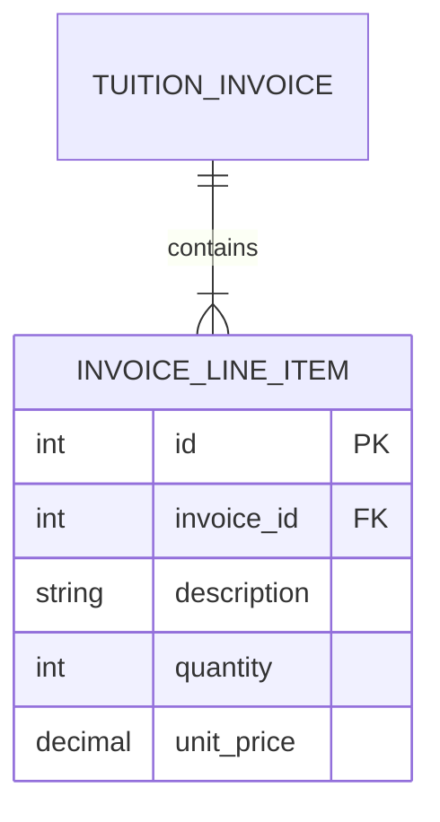

# Entity: Invoice Item (InvoiceLineItem)

The `InvoiceLineItem` entity represents a single breakdown line inside a `TuitionInvoice`.

---

## 1. Purpose

It displays detailed descriptions, quantities, and item prices on student billing statements.

---

## 2. Relationships

An `InvoiceLineItem` connects to:
* **TuitionInvoice**: Many-to-one via `invoice` (ForeignKey).

---

## 3. Lifecycle

1. **Creation**: Saved simultaneously during the creation of a parent `TuitionInvoice`.
2. **Deletion**: Modified or deleted along with the invoice editing flows. Purged automatically if the parent invoice is deleted (cascade delete).
