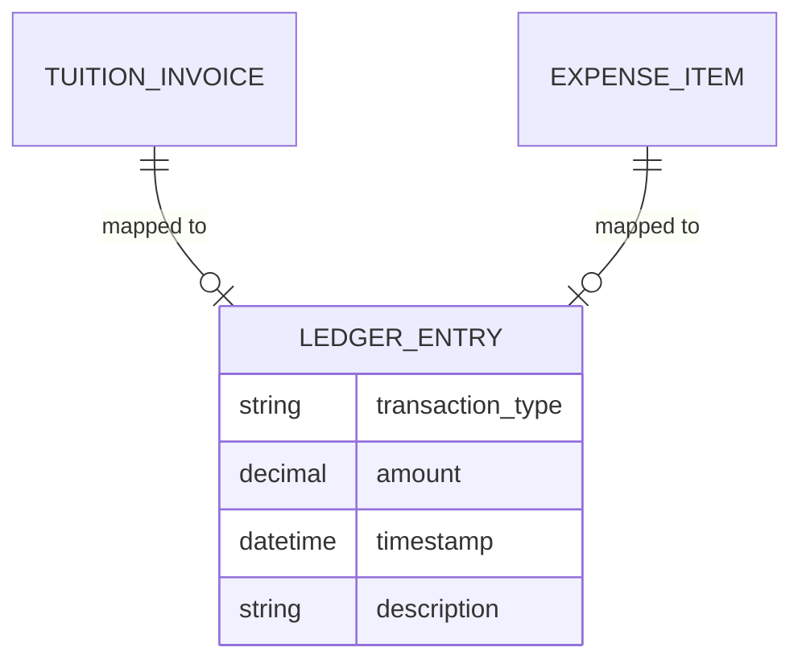

# Entity: Ledger Entry

The `LedgerEntry` represents a unified financial transaction record aggregated from both `TuitionInvoice` and `ExpenseItem` models.

---

## 1. Purpose

It provides a single transaction ledger dashboard inside `/finance/ledger` to display incoming revenue (paid invoices) and outgoing costs (approved expenses) in chronological order.

---

## 2. Relationships

A `LedgerEntry` acts as a polymorphic record derived from:
* **TuitionInvoice** (Credit / Incoming)
* **ExpenseItem** (Debit / Outgoing)

---

## 3. Lifecycle

1. **Aggregation**: Computed dynamically in the backend (e.g., via `/api/auth/finance/summary/`) or assembled in frontend state.
2. **Display**: Sorted by `created_at` or `incurred_at` timestamps.
3. **Filtering**: Filtered by date range, category, status, or transaction type to analyze net operational cash flows.
