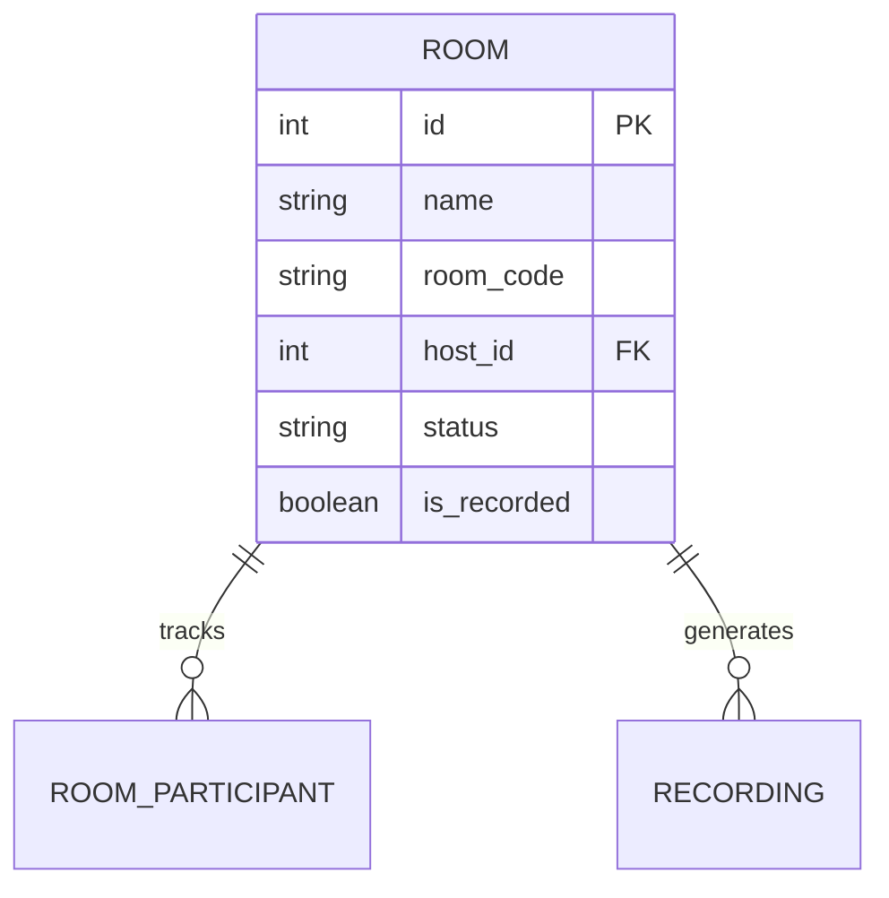

# Entity: Live Room (Room)

The `Room` entity (referred to as Live Room) represents an active WebRTC virtual classroom session powered by LiveKit.

---

## 1. Purpose

It enables real-time audio/video streaming, screen-sharing, class chats, whiteboard collaboration, and interactive educational miniapps.

---

## 2. Relationships

A `Room` connects to:
* **User (Host)**: Many-to-one via `host` (ForeignKey).
* **Session**: Many-to-one via `session` (optional ForeignKey linking it to an academic schedule).
* **Organization**: Many-to-one via `organization` (optional ForeignKey).
* **RoomParticipant**: One-to-many via `participants` (reverse relationship mapping current active users).
* **User (Recording Delegate)**: Many-to-many via `recording_grants` (authorizing specific users to control recording triggers).
* **Recording**: One-to-many via `recordings` (reverse relationship).

---

## 3. Lifecycle

1. **Initialization**: Spawned with status `waiting` when a scheduled session starts or an ad-hoc room is created.
2. **Activation**: Transitions to `active` when the host logs in. Participants join, and WebSocket handlers publish live events.
3. **Termination**: When the host ends the call, status is set to `ended`, `ended_at` is marked, and participants are disconnected.
