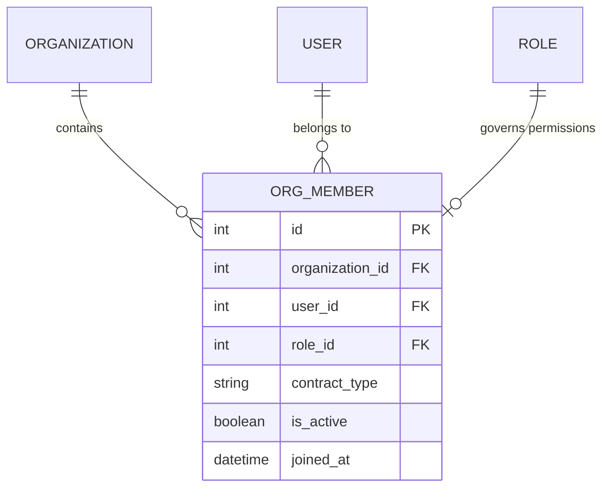

# Entity: Membership (OrgMember)

The `OrgMember` entity acts as the join table connecting a `User` to an `Organization` with a specific `Role`.

---

## 1. Purpose

It enables multi-tenant user mapping. It specifies which organization a user belongs to, what their contract type is (full-time, part-time, guest, contractor), and what role they hold within that tenant.

---

## 2. Relationships

An `OrgMember` connects to:
* **Organization**: Many-to-one via `organization` (ForeignKey).
* **User**: Many-to-one via `user` (ForeignKey).
* **Role**: Many-to-one via `role` (ForeignKey, SET_NULL on delete).

---

## 3. Lifecycle

1. **Creation**: An administrator invites a user or adds them to the organization. This creates the membership and assigns a role.
2. **Update**: An admin can update the member's role (e.g., promoting a Teacher to Admin), contract type, or expiration date.
3. **Deactivation**: Instead of deleting records, terminating a membership is done by setting `is_active = False` to preserve historical logs, course analytics, and financial invoice details.
