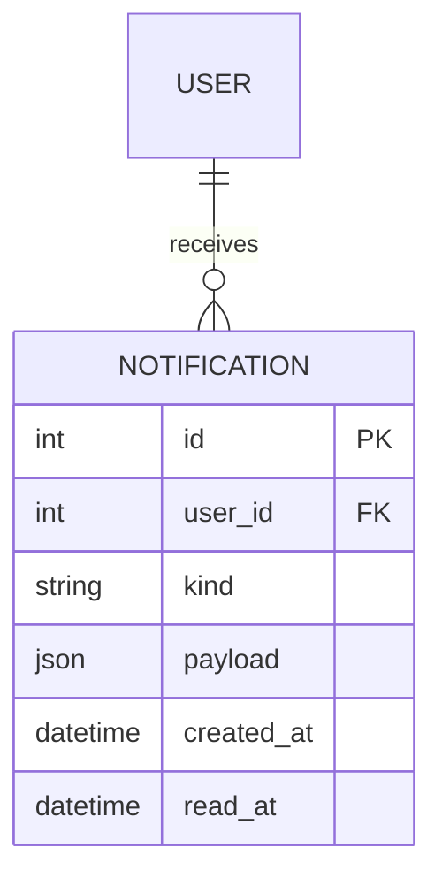

# Entity: Notification

The `Notification` entity represents a system alert or reminder delivered to a specific user.

---

## 1. Purpose

It manages asynchronous communication. It captures room invites, published recordings, custom broadcasts, and invoice alerts, storing them so users can view them even if they were offline when the event occurred.

---

## 2. Relationships

A `Notification` connects to:
* **User**: Many-to-one via `user` (ForeignKey).

---

## 3. Lifecycle

1. **Creation**: Triggered by backend actions (e.g., publishing a recording, broadcasting a classroom announcement, or inviting a student to a room). A database row is created.
2. **Push Delivery**: Dispatched immediately via WebSockets if the user has an active online connection.
3. **Read Acknowledgement**: Toggled when the user clicks "mark as read" on the notification list, setting `read_at` to the current timestamp.
4. **Purge**: Deleted manually by the user or automatically pruned after retention periods pass.
