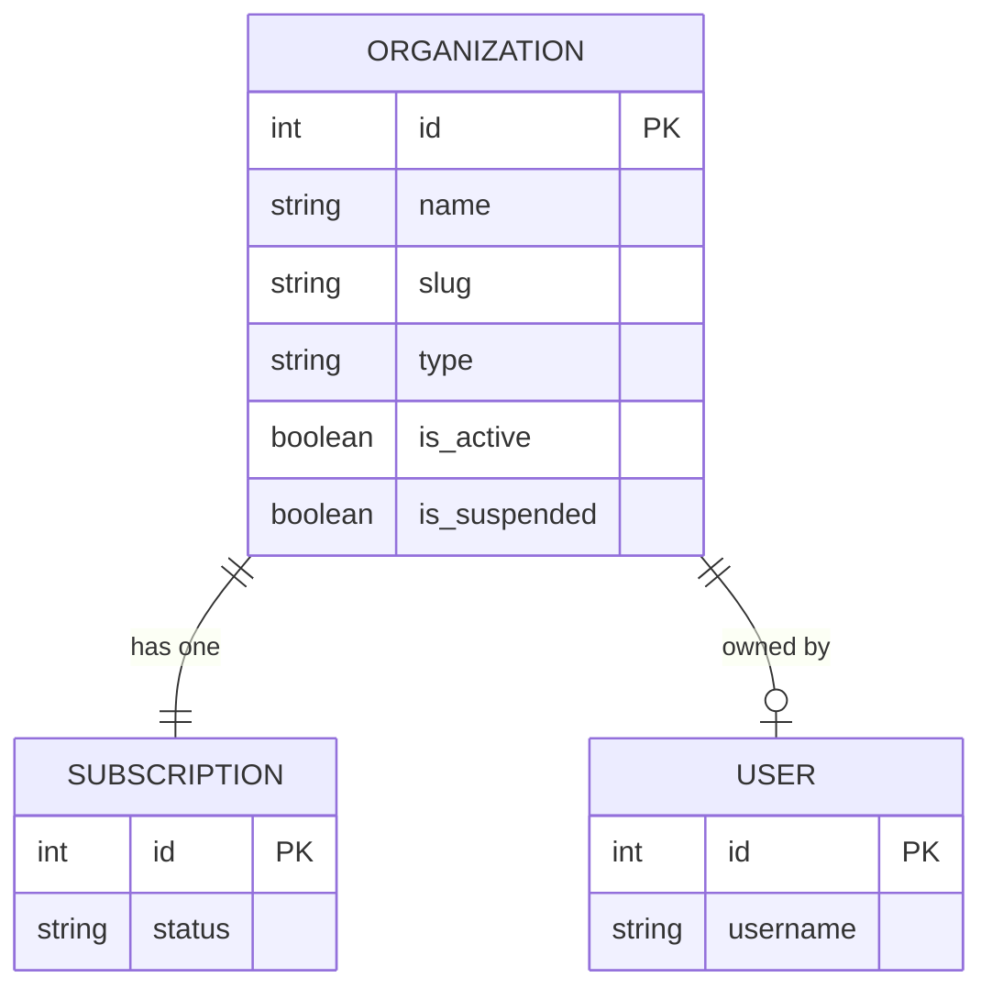

# Entity: Organization

The `Organization` entity represents the top-level tenant in the multi-tenant SaaS architecture. All courses, classes, financial transactions, settings, and memberships are scoped to an organization.

---

## 1. Purpose

It solves the problem of tenant separation. It isolates data, dashboards, configurations, subscription billing, and user spaces so that multiple educational institutions can use the platform securely without cross-tenant leakage.

---

## 2. Relationships

An `Organization` connects to:
* **User (Owner)**: One-to-many relationship via `owner` (ForeignKey to `User`).
* **OrgMember**: One-to-many via `members` (reverse relationship).
* **Role**: One-to-many via `custom_roles` (reverse relationship).
* **Course**: One-to-many via `courses` (reverse relationship).
* **Session**: One-to-many via `sessions` (reverse relationship).
* **TuitionInvoice**: One-to-many via `invoices` (reverse relationship).
* **ExpenseItem**: One-to-many via `expenses` (reverse relationship).
* **OrganizationSubscription**: One-to-one via `subscription` (reverse relationship).

---

## 3. Lifecycle

1. **Creation**: Created by a user registering an institution. A slug is generated, and the creating user is designated as the `owner`. A Stripe checkout is initiated to establish the `OrganizationSubscription` record.
2. **Update**: The owner or an admin can update the name, logo, and general details.
3. **Suspension**: Can be suspended by a superuser (`is_suspended = True`, `suspended_at` is set) for non-payment or violations. This locks all member logins under the tenant.
4. **Archival/Deletion**: Soft deletion is supported via `is_active = False` or suspension. Full deletion requires purging related DB records in a cascade.
