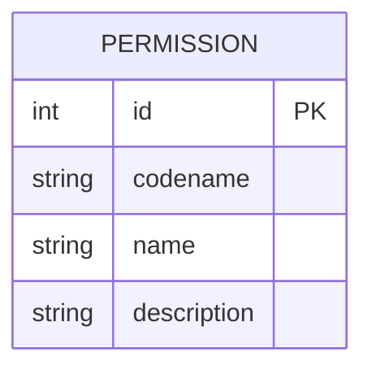

# Entity: Permission

The `Permission` entity represents a specific action that a user is allowed to perform on the platform.

---

## 1. Purpose

It acts as the atomic unit of the Role-Based Access Control (RBAC) system.

---

## 2. Relationships

A `Permission` connects to:
* **Role**: Many-to-many via `role_set` (reverse relationship).

---

## 3. Lifecycle

1. **Creation**: Permissions are predefined by system developers and created during initial migration/seeding. They are immutable from the user interface.
2. **Evaluation**: Checked dynamically in the backend using `has_org_permission(user, org, codename)` and in the frontend routing guards.
3. **Archival/Deletion**: Deletion is only done during system updates or migration rollbacks.
