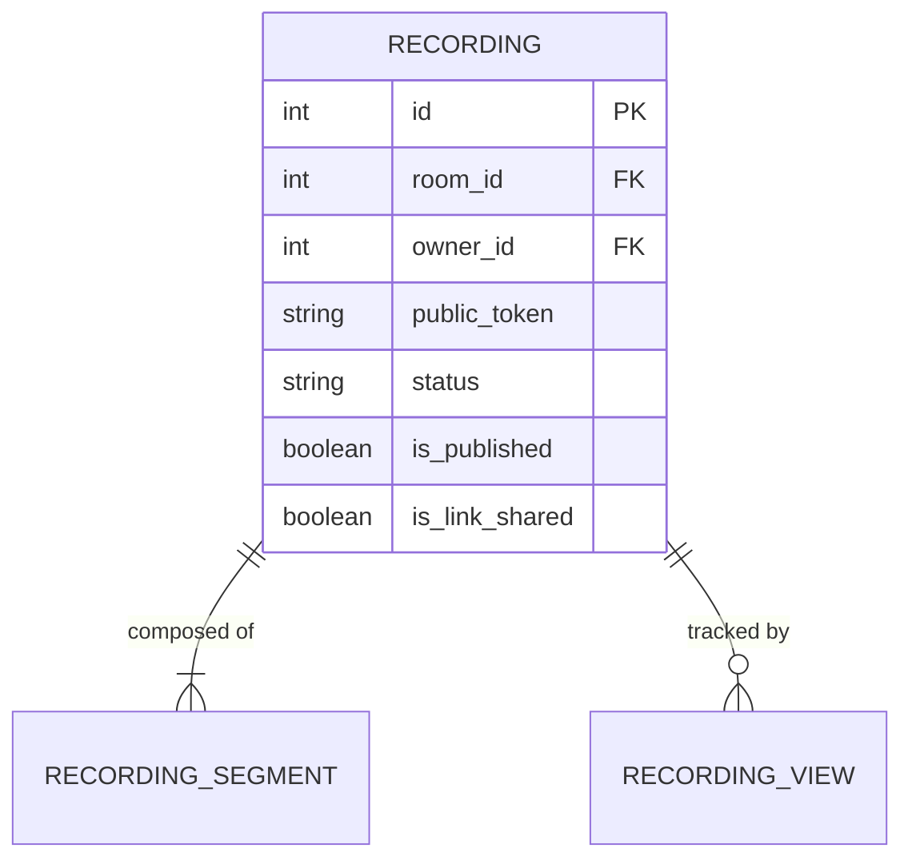

# Entity: Recording

The `Recording` entity represents a WebRTC session capture recording produced by the LiveKit Egress service.

---

## 1. Purpose

It manages classroom recordings, coordinates multi-segment recordings (handling stream pause/resume events), enables host video trimming and sharing, and tracks student viewing engagement.

---

## 2. Relationships

A `Recording` connects to:
* **Room**: Many-to-one via `room` (ForeignKey).
* **Session**: Many-to-one via `session` (optional ForeignKey).
* **User (Owner)**: Many-to-one via `owner` (ForeignKey referencing the teacher/host).
* **User (Viewer)**: Many-to-many via `visible_to` (defining the specific students who have viewing access).
* **RecordingSegment**: One-to-many via `segments` (reverse relationship mapping pause/resume chunk files).
* **RecordingView**: One-to-many via `views` (reverse relationship logging audience engagement telemetry).

---

## 3. Lifecycle

1. **Trigger**: Initiated during a WebRTC call by the host. A `Recording` row is created with status `starting`.
2. **Recording & Pauses**: Egress worker records data. If paused, a new segment is created upon resume. Status moves between `recording` and `paused`.
3. **Muxing**: When stopped, status moves to `processing`, and segments are stitched together. On completion, `file_path`, size, and duration are set, status becomes `completed`.
4. **Publishing & Sharing**: The host trims boundaries (`trim_start_seconds`, `trim_end_seconds`) and sets `is_published = True`. Sharing settings are configured.
5. **Soft Deletion**: Moving `is_deleted = True` hides the recording from listings but preserves rows for audit logs.
