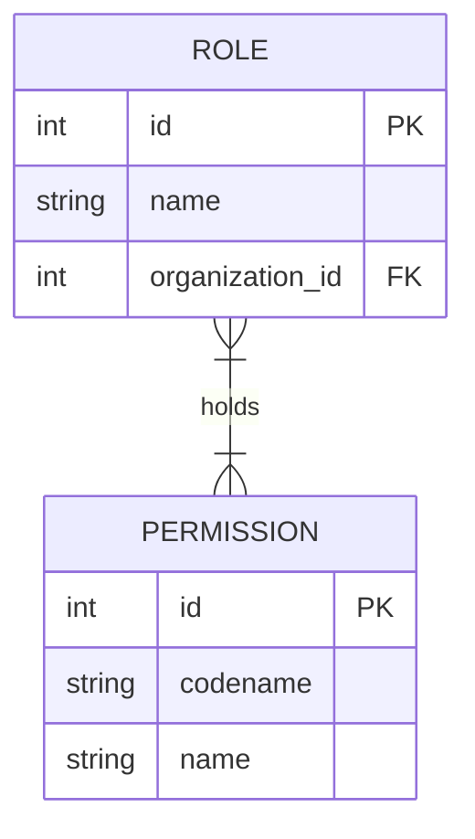

# Entity: Role

The `Role` entity defines a set of permissions. It can be system-wide (global roles like Admin, Teacher, Student, Mentor) or custom to an organization.

---

## 1. Purpose

It groups individual permissions into logical clusters to simplify user access control management.

---

## 2. Relationships

A `Role` connects to:
* **Organization**: Many-to-one via `organization` (optional; null for global roles, defined for tenant-specific roles).
* **Permission**: Many-to-many via `permissions` (defining the capabilities granted by the role).
* **OrgMember**: One-to-many via `orgmember_set` (assigning the role to memberships).

---

## 3. Lifecycle

1. **Creation**: Global roles are seeded during database setup. Custom roles can be created by organization admins via the settings panel.
2. **Update**: Admins can edit the permissions mapped to custom roles.
3. **Deletion**: Deleting a custom role will set the `role` field on related `OrgMember` instances to `None` (null).
