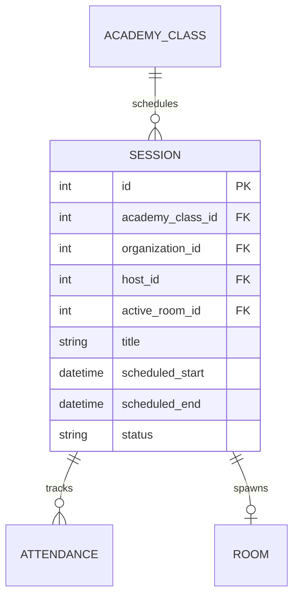

# Entity: Session

The `Session` entity represents an individual class meeting or lecture event, which can be scheduled, active (live), or completed.

---

## 1. Purpose

It manages session schedules, prevents teacher/room booking overlaps, serves as the launcher for live WebRTC video rooms, and tracks attendance.

---

## 2. Relationships

A `Session` connects to:
* **AcademyClass**: Many-to-one via `academy_class` (optional ForeignKey; null for ad-hoc meetings).
* **Organization**: Many-to-one via `organization` (ForeignKey).
* **User (Host)**: Many-to-one via `host` (ForeignKey).
* **Room (Active Room)**: Many-to-one via `active_room` (ForeignKey pointing to the active room context).
* **Attendance**: One-to-many via `attendance_records` (reverse relationship).
* **Assessment**: One-to-many via `assessments` (reverse relationship).
* **Recording**: One-to-many via `recordings` (reverse relationship).

---

## 3. Lifecycle

1. **Scheduling**: Created with status `scheduled` by an admin or teacher, setting start/end times, verifying host and room availability.
2. **Going Live**: Transitioned to `live` (via `start_live()`) when the teacher launches the session. This creates/attaches an active WebRTC `Room`.
3. **Completion**: Transitioned to `completed` (via `complete()`) when the host ends the call. A webhook triggers the stitching of recordings, and attendance forms are finalized.
