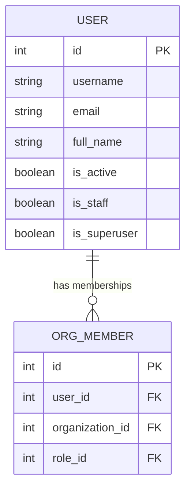

# Entity: User

The `User` entity represents an individual person registered on the platform. It inherits from Django's `AbstractUser` and extends it with profile metadata.

---

## 1. Purpose

It handles authentication, credentials, profiles, global platform authorization (superuser/staff), and multi-tenant mapping across organizations.

---

## 2. Relationships

A `User` connects to:
* **OrgMember**: One-to-many via `org_memberships` (defining their roles inside specific organizations).
* **Organization (Owned)**: One-to-many via `owned_organizations` (as the creator/owner).
* **AcademyClass (Teacher/Mentor)**: One-to-many via `teaching_classes` or `mentored_classes`.
* **Enrollment**: One-to-many via `enrollments` (as a student).
* **Submission**: One-to-many via `submissions` (taking assessments).
* **AssignmentSubmission**: One-to-many via `assignment_submissions` (submitting homework).
* **Recording**: One-to-many via `recordings` (as the host/creator).
* **Notification**: One-to-many via `notifications` (as the recipient).

---

## 3. Lifecycle

1. **Creation**: Created via the `/register` endpoint or by an Admin creating a new user. The default password is set and hashed.
2. **Profile Completion**: The user logs in and updates their avatar, notification preferences, or password.
3. **Suspension/Activation**: The account can be deactivated via `is_active = False` by a platform admin or automatic audit triggers.
4. **Archival/Purge**: Supports GDPR-compliant self-deletion (`/api/auth/privacy/delete-account/`), which cleans up personal identifiers or fully purges the record.
